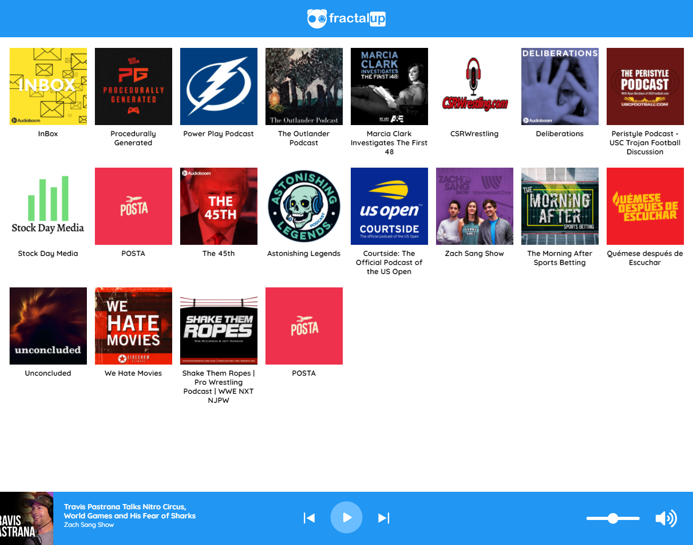

# FractalUp Reto 02 🙌

Aplicación web para reproducir clips de podcasts de la API Rest de AudioBoom [https://github.com/audioboom/api](https://github.com/audioboom/api 'API Rest AudioBoom')

### Qué contiene y cómo está desarrollada ❓

- Contiene:

  - Listado de podcast.
  - Reproductor de clips del podcast seleccionado.
  - Modulador de volumen.

- Está desarrollada con [Vue](https://vuejs.org/).

### Tecnologías utilizadas 👨‍💻

- [Vue CLI](https://cli.vuejs.org/)
- [Vuex](https://vuex.vuejs.org/)

### Live Preview 👁‍🗨

[https://pavd-fractalup-reto02.netlify.app](https://pavd-fractalup-reto02.netlify.app)

### Edpoints utilizados

- [https://api.audioboom.com/channels/recommended](https://api.audioboom.com/channels/recommended)

- [https://api.audioboom.com/channels/4920938/audio_clips](https://api.audioboom.com/channels/4920938/audio_clips)

### Clona el repositorio e instala las dependencias

- npm install
- npm run serve
